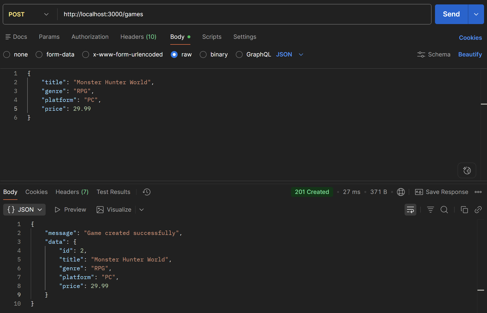
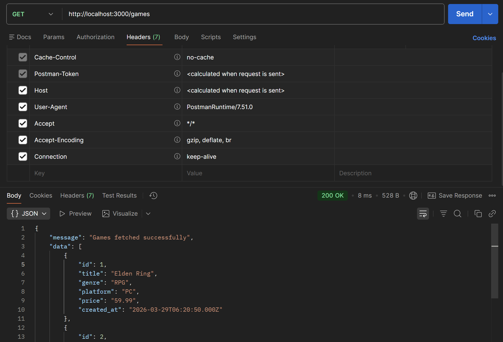
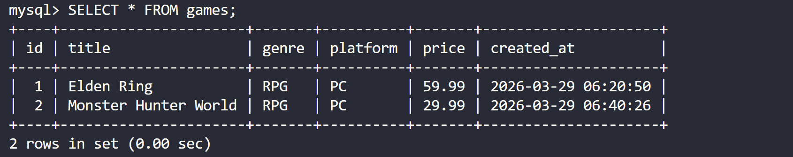

<div align="center">
  <h1>🎮 Games API</h1>

  <p>
    
    
    
    
  </p>

  <p>
    <strong>Simple REST API untuk manajemen data game</strong>
  </p>

  <p>
    
    
  </p>
</div>

---

## 🌟 Gambaran Umum

REST API sederhana untuk insert dan mengambil data game, dibangun dengan **Express.js** dan **MySQL** yang berjalan sepenuhnya di dalam **Docker**.

---

## 🛠️ Tech Stack

| Teknologi | Keterangan |
|-----------|-----------|
| Node.js | Runtime JavaScript |
| Express.js | Web framework |
| MySQL 8.0 | Database |
| Docker & Docker Compose | Containerization |
| dotenv | Environment variable management |
| mysql2 | MySQL driver untuk Node.js |

---

## 📁 Struktur Proyek

```
.
├── src/
│   ├── config/
│   │   ├── db.js           # Konfigurasi koneksi database
│   │   └── env.js          # Konfigurasi dotenv
│   ├── controllers/
│   │   └── gameController.js   # Handler request & response
│   ├── models/
│   │   └── game.js         # Query database
│   └── routes/
│       └── gameRoute.js    # Definisi endpoint
├── database/
│   └── init.sql            # Script inisialisasi tabel
├── .env.example            # Template environment variable
├── .gitignore
├── .dockerignore
├── docker-compose.yml
├── Dockerfile
├── index.js                # Entry point aplikasi
└── package.json
```

---

## ⚙️ Konfigurasi Environment

Salin file `.env.example` menjadi `.env` dan sesuaikan nilainya:

```bash
cp .env.example .env
```

```env
PORT=             # Port aplikasi
DB_HOST=          # Gunakan 'localhost' untuk lokal, 'db' untuk Docker
DB_USER=          # Username MySQL
DB_PASSWORD=      # Password MySQL
DB_NAME=          # Nama database
DB_PORT=          # Default MySQL: 3306
```

---

## 🚀 Cara Menjalankan

Pastikan **Docker** sudah terinstall, lalu jalankan:

```bash
docker-compose up -d
```

Aplikasi akan berjalan di `http://localhost:3000`

Untuk menghentikan:
```bash
docker-compose down
```

---

## 🔌 API Endpoints

| Method | Endpoint | Deskripsi |
|--------|----------|-----------|
| GET | `/games` | Ambil semua data game |
| POST | `/games` | Tambah data game baru |

---

### POST `/games`

**Request Body:**
```json
{
    "title": "Elden Ring",
    "genre": "RPG",
    "platform": "PC",
    "price": 59.99
}
```

**Response (201 Created):**
```json
{
    "message": "Game created successfully",
    "data": {
        "id": 1,
        "title": "Elden Ring",
        "genre": "RPG",
        "platform": "PC",
        "price": 59.99
    }
}
```

---

### GET `/games`

**Response (200 OK):**
```json
{
    "message": "Games fetched successfully",
    "data": [
        {
            "id": 1,
            "title": "Elden Ring",
            "genre": "RPG",
            "platform": "PC",
            "price": 59.99,
            "created_at": "2025-01-01T00:00:00.000Z"
        }
    ]
}
```

---

## 📸 Screenshots

### POST /games — Status 201 Created


### GET /games — Status 200 OK


### Data di Database


---

— Wahyu Pratama
